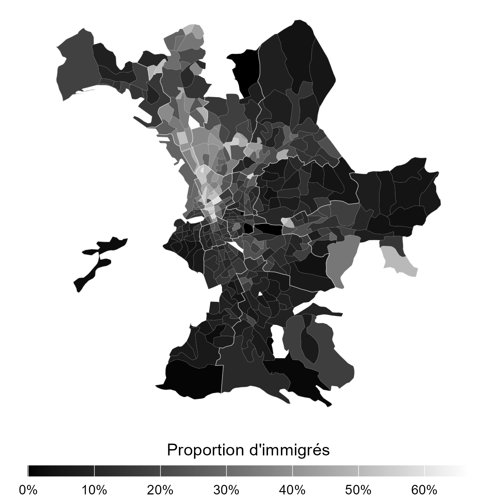

# Ségrégation résidentielle à Marseille

Ce repo contient les fichiers nécéssaires à la reproduction de l'illustration produite pour le chapitre *Ségrégation spatiale* de l'ouvrage *Comprendre les migrations internationales*, CNRS Éditions, à paraître.

## Environnement logiciel 

- R version 4.5.3 "Reassured Reassurer"
- RStudio 2026.05.0+218 "Golden Wattle" 
- Quarto 1.9.36 
- Packages : data.table 1.18.2.1, tidyverse 2.0.0, scales 1.4.0, sf 1.1.0.

## Bases de données à télécharger
 - [Insee – Fichier détail – Recensement de la population 2022](https://www.insee.fr/fr/statistiques/8647099) ([Fichier régional Zone E](https://www.insee.fr/fr/statistiques/fichier/8647099/RP2022_logemtze.zip))
 - [IGN – Admin Express – France 2022](https://cartes.gouv.fr/rechercher-une-donnee/dataset/IGNF_ADMIN-EXPRESS) (Fichiers CONTOURS-IRIS)

## Structure 

```
├── code.qmd
├── out/
└── src/
    ├── CONTOURS-IRIS.cpg
    ├── CONTOURS-IRIS.dbf
    ├── CONTOURS-IRIS.prj
    ├── CONTOURS-IRIS.shp
    ├── CONTOURS-IRIS.shx
    └── FD_LOGEMTZE_2022.csv
```

## Résultat


